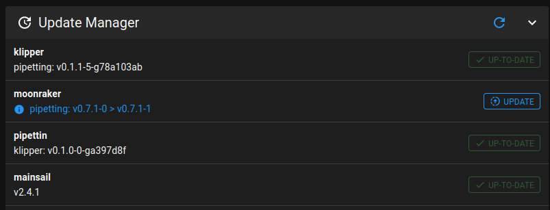

# Moonraker fork for the Pipetting-bot

For use with: https://github.com/naikymen/klipper-homing-extruder

To accomplish the following:



#  Moonraker - API Web Server for Klipper

Moonraker is a Python 3 based web server that exposes APIs with which
client applications may use to interact with the 3D printing firmware
[Klipper](https://github.com/KevinOConnor/klipper). Communcation between
the Klippy host and Moonraker is done over a Unix Domain Socket.  Tornado
is used to provide Moonraker's server functionality.

Documentation for users and developers can be found on
[Read the Docs](https://moonraker.readthedocs.io/en/latest/).

### Clients

Note that Moonraker does not come bundled with a client, you will need to
install one.  The following clients are currently available:

- [Mainsail](https://github.com/mainsail-crew/mainsail) by [Mainsail-Crew](https://github.com/mainsail-crew)
- [Fluidd](https://github.com/fluidd-core/fluidd) by Cadriel
- [KlipperScreen](https://github.com/jordanruthe/KlipperScreen) by jordanruthe
- [mooncord](https://github.com/eliteSchwein/mooncord) by eliteSchwein

### Raspberry Pi Images

Moonraker is available pre-installed with the following Raspberry Pi images:

- [MainsailOS](https://github.com/mainsail-crew/MainsailOS) by [Mainsail-Crew](https://github.com/mainsail-crew)
  - Includes Klipper, Moonraker, and Mainsail
- [FluiddPi](https://github.com/fluidd-core/FluiddPi) by Cadriel
  - Includes Klipper, Moonraker, and Fluidd

### Docker Containers

The following projects deploy Moonraker via Docker:

- [prind](https://github.com/mkuf/prind) by mkuf
  - A suite of containers which allow you to run Klipper in
    Docker.  Includes support for OctoPrint and Moonraker.

### Changes

This section contains changelogs that users and developers may reference
to see if any action is necessary on their part.  The date of the most
recent change is included.

Users:\
[user_changes.md](https://moonraker.readthedocs.io/en/latest/user_changes/) - January 2nd 2023

Developers:\
[api_changes.md](https://moonraker.readthedocs.io/en/latest/api_changes/) - March 4th 2022

# Development setup notes for Arch

A development setup for Arch Linux is achievable without giving it sudo permissions.

Systemd must be disabled everywhere:

- Run `install-moonraker.sh` with the `-z` option.
- Configure [moonraker.conf](./printer_data/config/moonraker.conf) with `validate_service: False`.

1. Install moonraker with:

```bash
# NOTE: set "PARENT_PATH" to where you cloned moonraker
export PARENT_PATH=${HOME}/Projects/GOSH/gosh-col-dev

export MOONRAKER_VENV=${PARENT_PATH}/moonraker/moonraker-env
./scripts/install-moonraker.sh -z -x -d ${PARENT_PATH}/moonraker/printer_data
```

See details on the script's usage [here](https://moonraker.readthedocs.io/en/latest/installation/).

2. Set `validate_service: False` in [`moonraker/printer_data/config/moonraker.conf`](./printer_data/config/moonraker.conf) (otherwise it asks for `

```
# Moonraker Configuration File

[server]
host: 0.0.0.0
port: 7125
# Make sure the klippy_uds_address is correct.  It is initialized
# to the default address.
klippy_uds_address: /tmp/klippy_uds

[machine]
provider: systemd_cli
# https://moonraker.readthedocs.io/en/latest/configuration/#machine
validate_service: False

```

4. Start Klipper. For install help see:
    - https://docs.mainsail.xyz/setup/manual-setup/klipper
    - _Note_: remember to have the `[virtual_sdcard]` setting in `printer.cfg` pointing to `printer_data/gcode`.

```bash
~/klipper/klippy/klippy.py "${HOME}/Projects/GOSH/gosh-col-dev/printer_data/config/printer.cfg" -l /tmp/klippy.log -a /tmp/klippy_uds
```

3. Setup and run Moonraker:
  - Klipper configuration files need to be in the `printer_data/config` directory, so that Mainsail can read them.
  - Note that `printer_data` **must not** be in the `moonraker` directory, otherwise Moonraker will deny access to Mainsail.
  - _Note_: Because klipper is started manually, these are not used unless pointed to in the previous step.

```bash
# Activate the virtual environment
source moonraker-env/bin/activate

# Start moonraker
moonraker/moonraker.py --datapath ../printer_data/ --configfile moonraker.conf -n
```

5. Visit http://localhost:7125/ to check that Moonraker is working, and no warnings are shown.

6. Run [Mainsail in Docker](https://docs.mainsail.xyz/setup/docker):

```bash
# To start the container normally.
#sudo docker run --name mainsail -v "$(pwd)/mainsail_config.json:/usr/share/nginx/html/config.json" -p "8080:80" ghcr.io/mainsail-crew/mainsail 

# Alternative: using the host's network (more insecure).
sudo docker run --name mainsail -v "${HOME}/Projects/GOSH/gosh-col-dev/moonraker/mainsail_config.json:/usr/share/nginx/html/config.json" --net="host" gh  
cr.io/mainsail-crew/mainsail

# To remove the container:
sudo docker rm mainsail
```
